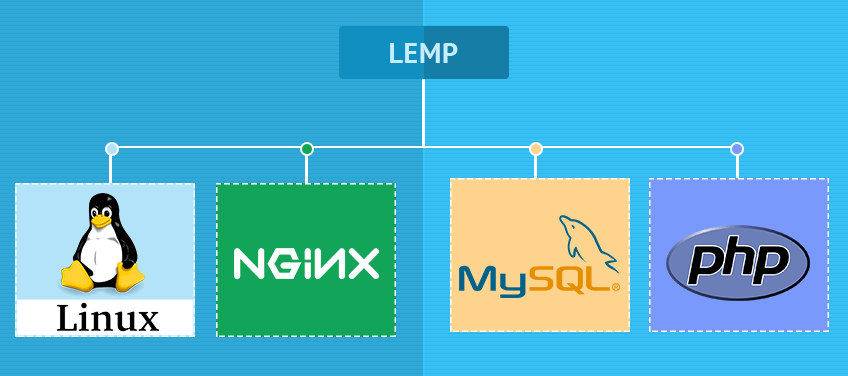
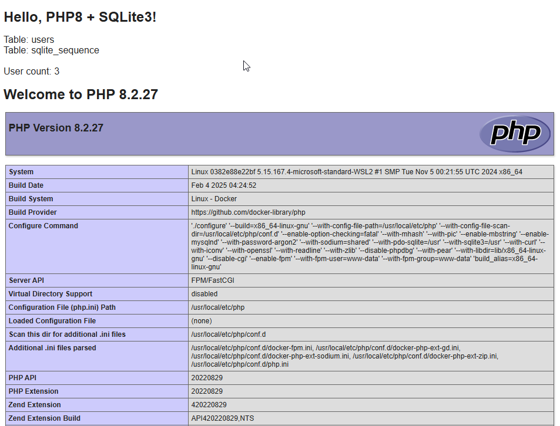
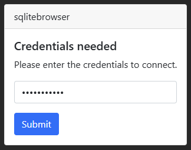
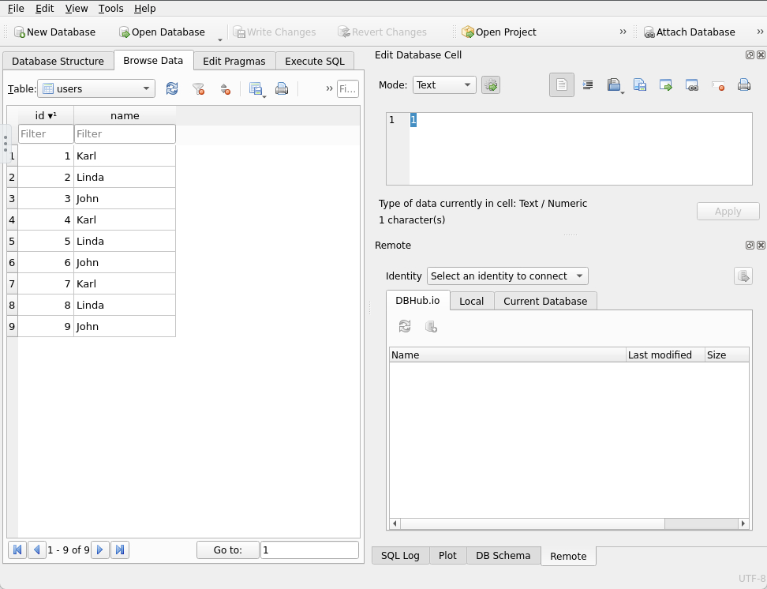

# Guide to Dockerize Nginx-SQLite3-PHP
**This guide shows you how to dockerize your LESP (Linux, Nginx, SQLite3, PHP) stack easily and quickly.**

by Marcus Zou | 20 Feb 2025 | 3 minutes Reading - 20 minutes Hands-on


## Intro

The LEMP stack is an open-source solution used to develop web applications. It is an acronym representing Linux, Nginx, MySQL/MariaDB, and PHP. In addition, it is widely popular and well-supported among the Open Source community.

However, installing and configuring all of these services takes time and skills. This is where Docker containers, specifically Docker Compose, come in. With its help, you can have your LEMP stack up and running in minutes and focus entirely on developing web apps without wasting time installing and configuring services.



But sometimes your task is not that heavy-duty in terms of data loads, then a light-weight **SQLite3** may get the job done, instead of adopting MySQL/MariaDB.

This guide will show you how to quickly and easily integrate Nginx, SQLite3, and PHP using Docker Compose. 

Without further ado, let’s work it out.

#### # Tech Stack

* __Linux__: Debian/Ubuntu is preferred
* __Nginx__: The Frontend Web UI server
* __SQLite3__: A single file based, light-weight database
* __PHP__: 8.2-FPM

#### # Prerequisites

- Linux: Debian or Ubuntu preferred, WSL2 distro works well
- Docker Engine/Desktop installed

- Run the command below to ensure that Docker Compose is installed and functioning correctly.

  ```shell
  docker -- version
  ## Docker version 27.5.1, build 9f9e405
  docker compose version
  ## Docker Compose version v2.32.4
  ```

  

## Quick-Start

1. Git clone my repo: https://github.com/marcuszou/lemp-typecho.git.

   ```shell
   git clone https://github.com/marcuszou/lemp-sqlite3.git
   ```

2. Fine tune the `docker-compose.yml` as needed.

   ```shell
   sudo chown -R $USER:$USER ./lemp-sqlite3
   cd lemp-sqlite3
   nano docker-compose.yml
   ```

3. Fire up the docker containers. 

   ```shell
   docker compose up -d
   ```

   Docker will pull down the relevant images and start the containers, which will take some time.

4. Access the website via http://localhost:8080 for the Web, 

5. Access the SQLite Browser at http://localhost:3000 or https://localhost:3001.


## Details of the Guide

I would like to throw in the final realization in one go.


### 1- Folder Structure Design

The folder structure could be designed as below:

```shell
-- File: `README.md`
-- File: `docker-compose.yml`
-- Folder: `db/data/`
-- Folder: `nginx/`
-- Folder: `php/`
-- Folder: `www/html`
```

Create the folder structure and files.

```shell
## create project folder
mkdir lemp-sqlite3
cd lemp-sqlite3
## generate sub-folders
mkdir -p db/{data,dir} nginx/{conf,logs} php www/html
## generate files
touch README.md docker-compose.yml nginx/conf/default.conf 
touch php/{Dockerfile,php.ini,php-log.conf} 
touch www/html/index.php
## display the folder/files structure
tree
```

Here is the output of last command above: Exactly same as what we designed, fantastic, isn't it?

```shell
.
├── README.md
├── docker-compose.yml
├── db
│   └── data
├── nginx
│   ├── conf
│   │   └── default.conf
│   └── logs
├── php
│   ├── Dockerfile
│   ├── php-log.conf
│   └── php.ini
└── www
    └── html
        └── index.php
```


### 2- Create the Nginx + PHP Containers

Create and launch an Nginx container to host the PHP application in a PHP container.

```shell
## edit the docker-compose.yml file
nano docker-compose.yml
```

Here is the full content of the `docker-compose.yml` file:

```shell
# Services
services:

  # Nginx Service
  nginx:
    container_name: web
    image: nginx:alpine
    ports:
      - 8080:80
    restart: always
    environment:
      - TZ=America/Edmonton
    links:
      - php
    volumes:
      - ./www/html/:/var/www/html/
      - ./nginx/conf/:/etc/nginx/conf.d/
      - ./nginx/logs/:/var/log/nginx/
    depends_on:
      - php
    networks:
      - lemp-sqlite3-net

  # PHP-FPM Service
  php:
    container_name: php8
    build: php
    expose:
      - 9000
    restart: always
    environment:
      - TZ=America/Edmonton
    volumes:
      - ./www/html/:/var/www/html/
      - ./db/data/:/data/
      # php-fpm config files are located at /usr/local/etc/php-fpm.d/ folder
      - ./php/php-log.conf:/usr/local/etc/php-fpm.d/zz-log.conf
      - ./php/php.ini:/usr/local/etc/php/conf.d/php.ini
      - ./db/data/:/data/
    networks:
      - lemp-sqlite3-net

# Networks
networks:
  lemp-sqlite3-net:
```

The above file will 

- download the latest Nginx image, create an Nginx container (internal port 80), and expose it on port 8080.

- mapping the local web root directory (`./www/html/`) to the standard web folder (`/var/www/html/`) in the container.
- the Nginx container serves the web with config file: `nginx/default.conf`, mapping to `/etc/nginx/conf.d/default.conf`. 
- link the Nginx container to PHP container, 

- build a new PHP container (based on docker image: `php:8.2-pfm`), expose PHP-FPM on port 9000, as per a Dockerfile template at `./php/Dockerfile`.
- map and mount the volume to the PHP container so that all contents at `./www/html` folder will be in sync with the container’s directory `/var/www/html/`.
- another 2 typical config files (`php.ini`, `php-log.conf`) will be mapped as well.

- the PHP-FPM container while install quite a bunch of PHP extensions to drive up SQLite3 database serving at port 9000. 


### 3- Configure the Nginx Container

3.1 - Edit the Nginx default configuration file to run your PHP application:

```
nano nginx/conf/default.conf
```

Add the following lines:

```
server {

    listen 80 default_server;
    root /var/www/html;
    index index.html index.php;

    charset utf-8;
     
    location / {
        try_files $uri $uri/ /index.php?$query_string;
    }

    location = /favicon.ico { access_log off; log_not_found off; }
    location = /robots.txt { access_log off; log_not_found off; }

    access_log off;
    error_log /var/log/nginx/error.log error;

    sendfile off;

    client_max_body_size 100m;

    location ~ .php$ {
        fastcgi_split_path_info ^(.+.php)(/.+)$;
        fastcgi_pass php:9000;
        fastcgi_index index.php;
        include fastcgi_params;
        fastcgi_param SCRIPT_FILENAME $document_root$fastcgi_script_name;
        fastcgi_intercept_errors off;
        fastcgi_buffer_size 16k;
        fastcgi_buffers 4 16k;
    }

    location ~ /.ht {
        deny all;
    }
}
```

Save and close the file.


### 4– Configure the PHP Container


__4.1__ - First, we must modify the PHP image and install the PHP extensions for driving PHP to connect to the SQLite3 database. So, edit the `php/Dockerfile` to build a **custom PHP image** while installing the PHP extensions:

```
nano php/Dockerfile
```

Add the following lines:

```
FROM php:8.2-fpm

# Installing dependencies for the PHP modules
RUN apt-get update
RUN apt-get install -y curl unzip zip libbz2-dev libcurl3-dev libjpeg62-turbo-dev libpng-dev libonig-dev libssl-dev libsqlite3-dev libxml2-dev libzip-dev
# libonig-dev is needed for oniguruma which is needed for php-mbstring
RUN rm -rf /var/lib/apt/lists/*

# Installing PHP modules: curl, mbstring, pdo, pdo_sqilte ...
RUN docker-php-ext-install curl gd mbstring pdo pdo_sqlite xml zip

# COMPOSER - the PHP dependency manager
RUN curl -sS https://getcomposer.org/installer | php -- --install-dir=/usr/local/bin --filename=composer
```

Save and close the file. 

__4.2__ - Also configure the php-fpm by `nano php/php.ini`, which will be mapped in the `docker-compose.yml` later.

```shell
date.timezone=UTC
display_errors=On
log_errors=On
upload_max_filesize= 80M
post_max_size= 80M
memory_limit = 256M
```

__4.3__ - And configure the logs by `nano php/php-log.conf`, which will also be mapped later.

```shell
php_admin_flag[log_errors] = on
php_flag[display_errors] = off
```


### 5-  SQLite3 Database Setup


The  beauty of adopting SQLite3 database is no complex settings at all, since the database will be created on the fly when launching the `index.php`. 

So, edit the **`www/html/index.php`** file and make changes to test the database connection.

```
nano www/html/index.php
```

Make the following changes:

```php+HTML
<!DOCTYPE html>
<html>
     <head>
          <title>Hello PHP8!</title>
     </head>  

     <body>
          <h1>Hello, PHP8 + SQLite3!</h1>
          <?php
               $db = new SQLite3('/data/testing.sqlite', SQLITE3_OPEN_CREATE | SQLITE3_OPEN_READWRITE);
               // Create a table.
               $db->query(
                    'CREATE TABLE IF NOT EXISTS "users" (
                         "id" INTEGER PRIMARY KEY AUTOINCREMENT NOT NULL,
                         "name" VARCHAR
                         )'
                    );
               // Insert some sample data.
               $db->query('INSERT INTO "users" ("name") VALUES ("Karl")');
               $db->query('INSERT INTO "users" ("name") VALUES ("Linda")');
               $db->query('INSERT INTO "users" ("name") VALUES ("John")');

               // Get the name of the tables in SQLite3 database
               $tableQuery = $db->query("SELECT name FROM sqlite_master WHERE type='table';");
               while ($myTable = $tableQuery->fetchArray(SQLITE3_ASSOC)) {
                    echo "Table: " . $myTable['name'] . "<br />";
               }
               echo "<br />";
               
               
               // Get a count of the number of users
               $userCount = $db->querySingle('SELECT COUNT(DISTINCT "id") FROM "users"');
               echo("User count: $userCount\n");
               // Close the connection
               $db->close();
          ?>

          <h1> <?php echo 'Welcome to PHP ' . phpversion(); ?> </h1>
          <p> <?php phpinfo(); ?> </p>
     </body>
</html>
```

Save and close the file. 


### 6- Dry Run


Launch the containers with the following command:

```
docker compose up -d
```

Due to the long time needed to build a custom PHP image and container, this part may take quite a time, so be patient.

Verify all running containers with the following command:

```
docker ps -a
## There are 2 containers now.
```

You should see the following output:

> CONTAINER ID   IMAGE              COMMAND                  CREATED             STATUS             PORTS                                     NAMES
> 381e168ff409   nginx:alpine       "/docker-entrypoint.…"   About an hour ago   Up About an hour   0.0.0.0:8080->80/tcp, [::]:8080->80/tcp   web
> 0382e88e22bf   lesp-typecho-php   "docker-php-entrypoi…"   About an hour ago   Up About an hour   9000/tcp                                  php8

Also access **http://localhost:8080** to take a look. Obviously there are 3 users created in the table `users`.




### 7- Final Touch-up

The final touch-up is to hook up the [SQLite Browser](https://sqlitebrowser.org/). *DB Browser for SQLite* (DB4S) is a high quality, visual, [open source](https://github.com/sqlitebrowser/sqlitebrowser) tool designed for people who want to create, search, and edit [SQLite](https://www.sqlite.org/) or [SQLCipher](https://www.zetetic.net/sqlcipher/) database files. DB4S gives a familiar spreadsheet-like interface on the database in addition to providing a full SQL query facility. It works with Windows, macOS, and most versions of Linux and Unix. 

Currently in the market, there are some open-source docker containers:

- lscr.io/linuxserver/sqlitebrowser:latest - updating very often, reply on UID/GID of the host, VNC-based, big-sized: 1.5GB...
- __evgeniydoctor/sqlitebrowser__:latest - updating not-so-often, simple-setup, small-sized: 366MB...

So the latter was selected.

Nothing special, just simply add a service named "`sqlitebrowser`" in the end of the `docker-compose.yml` file.

```shell
  ......

  # SQLiteBrowser Service
  sqlitebrowser:
    container_name: sqlitebrowser
    image: evgeniydoctor/sqlitebrowser:latest
    ports:
      - 5800:5800
    restart: unless-stopped
    environment:
      - VNC_PASSWORD=vncP@ss2024
      - KEEP_APP_RUNNING=1
      - TZ=America/Edmonton
    volumes:
      - ./db/dir:/dbs/dir
      - ./db/data:/dbs/data
    depends_on: 
      - php
    networks:
      - lemp-sqlite3-net

# Networks
networks:
  lemp-sqlite3-net:
```

Then fire up the dockers. And access __http://localhost:5800__ for the `SQLite Browser` site. Feel free to remove the password if needed.



And the Admin GUI:




### 8- Environment Restoration

8.1 take down all containers

```shell
## To remove all comtainers created by this docker-compose.yml file, do:
docker compose down

## Alternatively remove all containers created by any yml files, do:
docker stop $(docker ps -aq)
docker rm $(docker ps -aq)
```

8.2 remove newly-created image

```shell
docker images
docker image rm lemp-sqlite3-php
docker image rm evgeniydoctor/sqlitebrowser
```

8.3 remove some left-over folders and files

```shell
sudo rm -rf db/data/*
sudo rm -rf nginx/logs/*
```


## Future Implementation: local SSL

* There are default passwords for MariaDB's `root` user and `zenusr` user specified in `docker/docker-compose.yml` or `./db/env/mysql.env`.
* You are strongly recommended to edit this `./db/env/mysql.env` to replace the passwords as needed.

* This docker configuration has not been security consolidated (with ssl). Expose it to public networks at your own risk!
* If you place the containers in the Cloud Service Providers (AWS, GCP, Azure, Digital Ocean, etc.), the SSL question will be taken care by them automatically.
* If you place them in a home NAS, you could manage the SSL with Nginx Proxy Manager via Let's Encrypt service.


## Outro

In the above guide, you learned how to deploy a PHP application with Nginx and SQLite3 using Docker and Docker Compose. You should now be able to host the PHP application in the production environment with Docker.


## License

MIT
